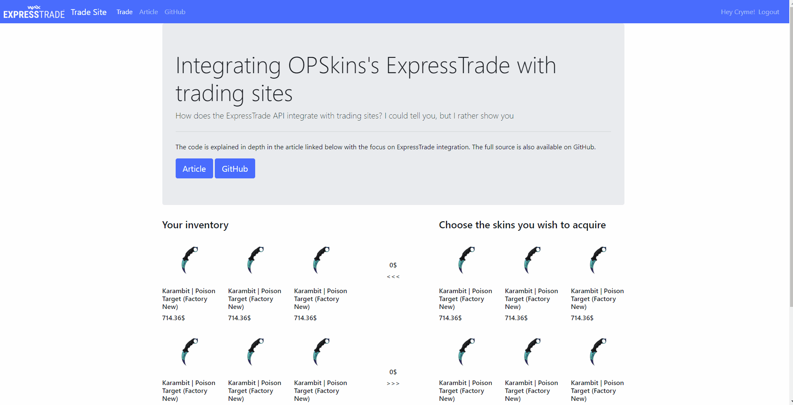

# Trade Site Integrated With OPSkins's ExpressTrade API

The intention of the open source code and associated article explaining it, is showcasing how OPSkins's ExpressTrade API can be integrated to any site despite size and stack. Now I could've written a short article briefly summarizing the features the ExpressTrade API exposes, instead I personally found it more educational to go through a thorough example of integrating the API to a trade site written from scratch. Not only discussing the API usage, but showing how virtual trading can easily be incorporated to any site hence the choice of the generic stack in this project; NodeJS, Express, jQuery, Bootstrap, and more.

Briefly described, "trade sites", are essentially a way of users to exchange their virtual items for other virtual items where the owner generally earns revenue by increasing the valuation of their items. Trading sites operate by allowing the user to construct a trade by choosing a number of virtual items they desire, and then by specifying a number of items from themselves in regard to how they wish to "pay" for these desired items. Once satisfied the user initiates trading. The site then automatically sends a trade offer to the user with the aforementioned items. Trading sites were widely used trading CS:GO skins before Steam’s new regulations. As many of us who are using OPSkins come from a background of CS:GO I found it perfect to showcase an example such as a trade site; because it's easier to build upon existing knowledge and hopefully after playing around with the code you'll feel comfertable enough to write your own site integrated with the ExpressTrade API.

## [Article explaining the code in depth](https://medium.com/@HundredElse/getting-started-with-opskinss-expresstrade-api-by-writing-a-trade-site-from-scratch-78b1dc2eab95)

## Getting started
To get the NodeJS server running locally:

- Clone this repository
- `npm install` in the repository's directory to install all required dependencies
- Replace configuration variables in `config.json` with your own API keys, secrets, etc
- `node app` or `nodemon app` to start the local server

---

